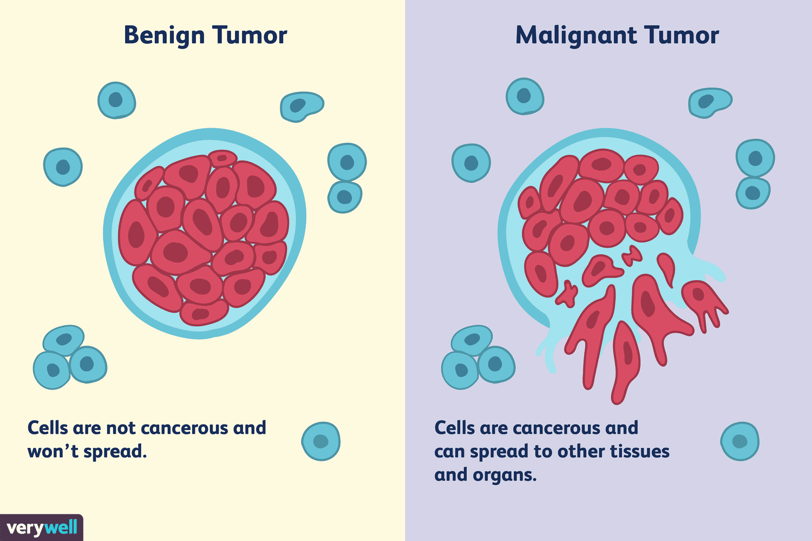
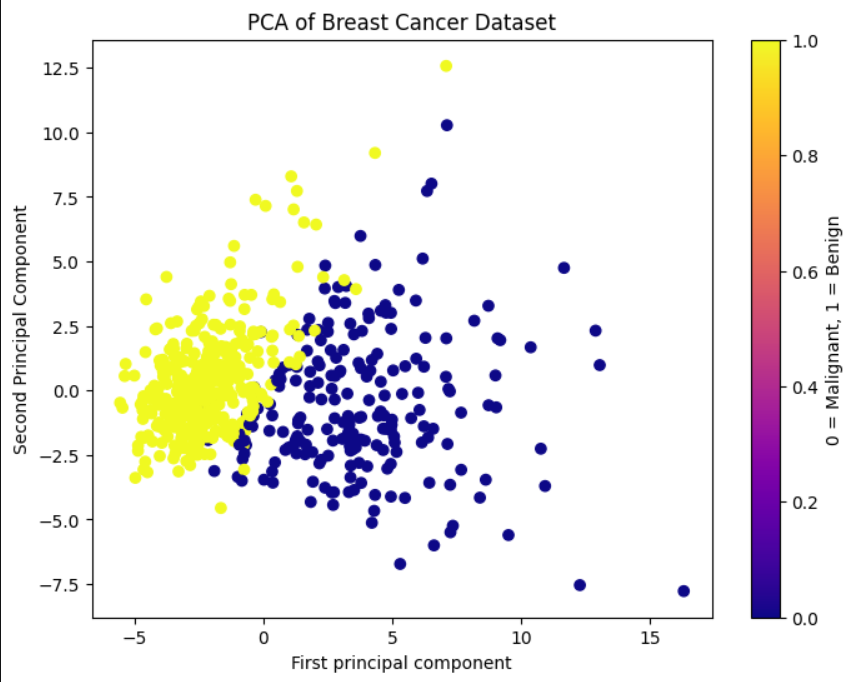
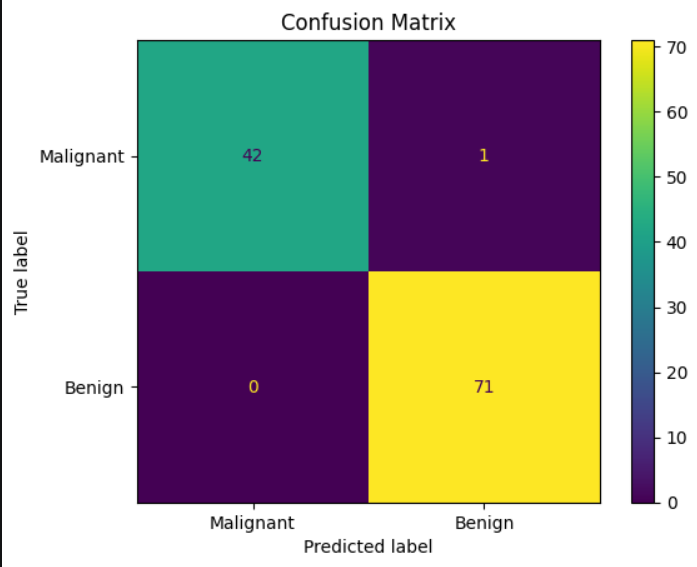

<h1 align="center">🔬 Breast Cancer Prediction using PCA 🔬</h1>
<h3 align="center">Principal Component Analysis + Logistic Regression</h3>

<p align="center">
  
  
  
  
</p>

---

## 📌 Project Overview

Diagnosing breast cancer accurately is critical — a missed malignant case can be life-threatening. But working with 30 raw medical features is complex and noisy.

This project applies **Principal Component Analysis (PCA)** to compress 30 features down to just **2 principal components**, then trains a **Logistic Regression** classifier on them — achieving **99% accuracy**, which is actually *better* than using all 30 features. PCA doesn't just reduce complexity; it removes noise and redundancy that hurts model performance.

---

## 📁 Repository Structure

```
Breast-Cancer-PCA/
├── images/
│   ├── pca_scatter.png
│   ├── confusion_matrix.png
│   └── Info.png
│
├── pca_main.ipynb
└── README.md
```

---

## 🛠️ Libraries Used

- `scikit-learn`
- `pandas`
- `numpy`
- `matplotlib`
- `seaborn`

---

## 📊 Dataset

**Breast Cancer Wisconsin (Diagnostic) Dataset** — built into `sklearn.datasets`

- **Samples:** 569
- **Features:** 30 (cell nucleus measurements)
- **Target Variable:** `target` — 0 = Malignant, 1 = Benign

| Class | Description |
|---|---|
| Malignant (0) | Cancerous cells that can spread to other tissues and organs |
| Benign (1) | Non-cancerous cells that do not spread |

<p align="center">
  
</p>

---

## ⚙️ Workflow

1. Load dataset using `sklearn.datasets.load_breast_cancer`
2. Create a DataFrame with all 30 feature columns
3. Standardize features using `StandardScaler` — essential before PCA
4. Apply PCA with `n_components=2` to reduce 30 → 2 dimensions
5. Visualize the 2D PCA space colored by class label
6. Train-Test Split — 80% train / 20% test (`random_state=42`)
7. Train `LogisticRegression` on the 2 PCA components
8. Evaluate using Classification Report and Confusion Matrix
9. Compare PCA model vs full 30-feature model
10. Run prediction on a new unseen sample

---

## 📈 PCA Visualization

<p align="center">
  
</p>

The two classes are clearly separable in the 2D PCA space — malignant tumors cluster to the right (higher PC1), while benign tumors cluster to the left. This confirms that PCA retained the most discriminative structure from the original 30 features.

---

## 🤖 Model Results

<p align="center">
  
</p>

| Metric | Malignant (0) | Benign (1) |
|---|---|---|
| Precision | 1.00 | 0.99 |
| Recall | 0.98 | 1.00 |
| F1-Score | 0.99 | 0.99 |
| **Accuracy** | **99%** | |

Only **1 misclassification** out of 114 test samples — 1 malignant case predicted as benign.

---

## ⚡ PCA vs Full Features

| Model | Features Used | Accuracy |
|---|---|---|
| Logistic Regression (Full) | 30 | 97% |
| **Logistic Regression (PCA)** | **2** | **99%** |

> PCA outperformed the full-feature model by eliminating noise and redundant variance — compressing 30 features into 2 while **improving** accuracy by 2% and recall on malignant cases from 0.95 → 0.98.

---

## 🧪 Sample Prediction

```python
# Take one sample from the original dataset
new_sample = scaled_data[0].reshape(1, -1)

# Transform it through PCA first
new_sample_pca = pca.transform(new_sample)

# Predict
prediction = model.predict(new_sample_pca)
print("Malignant" if prediction[0] == 0 else "Benign")
# Output: Malignant
```

---

## 🚀 How to Run

**1. Clone the repo**
```bash
git clone https://github.com/AnmolPatel20/Breast-Cancer-PCA.git
cd Breast-Cancer-PCA
```

**2. Install dependencies**
```bash
pip install pandas numpy matplotlib seaborn scikit-learn
```

**3. Run the notebook**
```bash
jupyter notebook pca_main.ipynb
```

---

## 📌 Notes
- No external dataset needed — the Breast Cancer Wisconsin dataset is bundled with `sklearn`
- Always standardize features **before** applying PCA — PCA is scale-sensitive
- The PCA object must be used to transform any new input before passing it to the model

---

## 🙋 About
I'm on my machine learning journey — building, experimenting and documenting as I go. Every notebook here represents something I've genuinely tried to understand, not just run. 🚀

- GitHub: [@AnmolPatel20](https://github.com/AnmolPatel20)
- Portfolio: [anmolpatel20.github.io/Anmol_Portfolio](https://anmolpatel20.github.io/Anmol_Portfolio/)

## 🙏 Acknowledgements
Thanks to **Krish Naik Sir** whose Udemy course has been a great resource throughout this learning journey.

*"In God we trust; all others must bring data." — W. Edwards Deming*

---

<p align="center">⭐ Star this repo if you found it helpful!</p>
